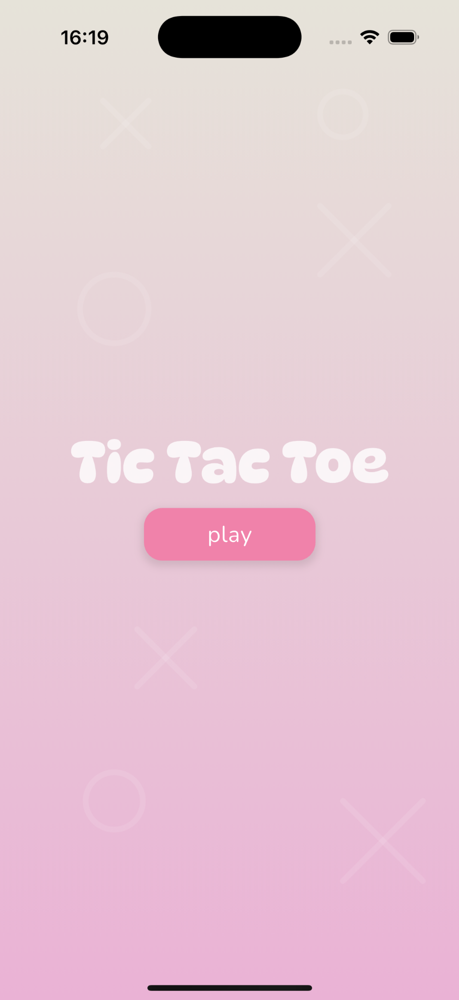
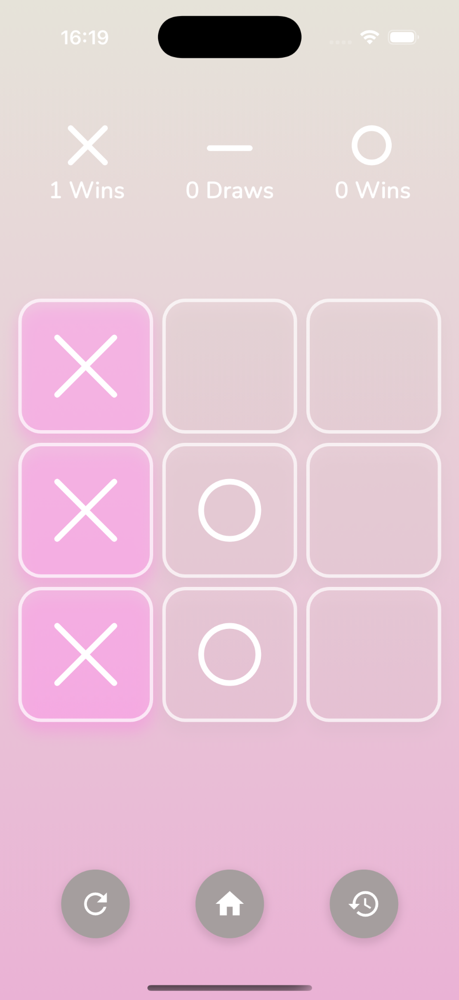
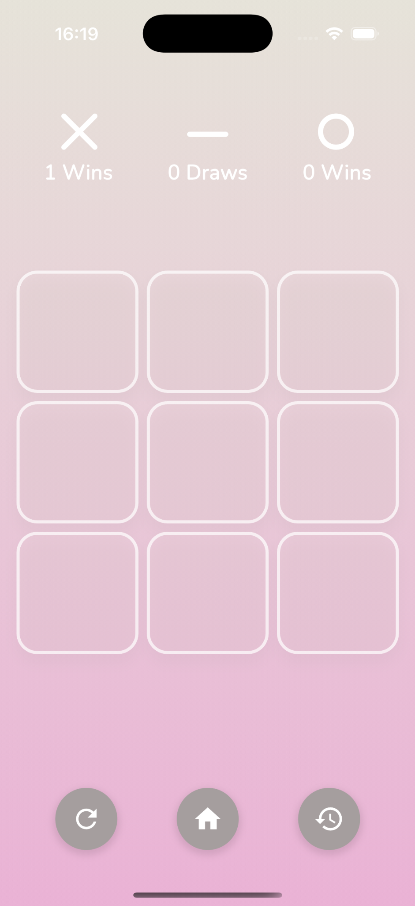
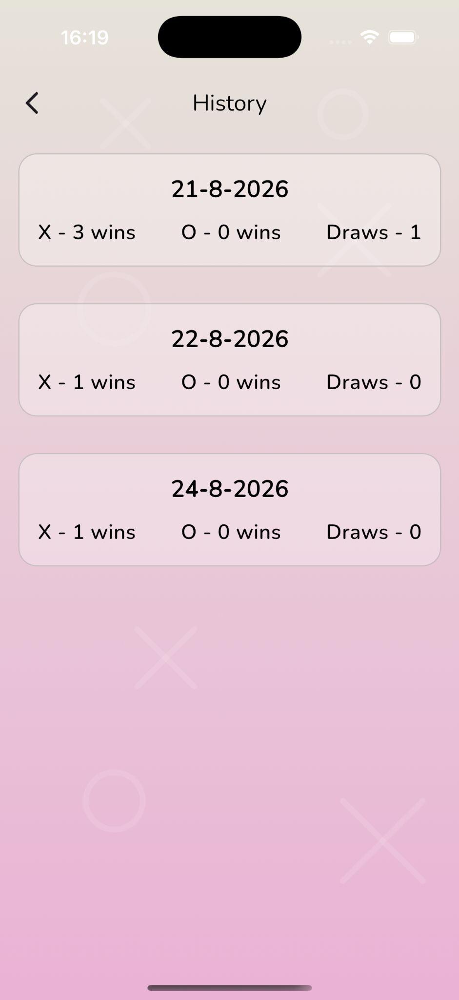

# Tic Tac Toe

A simple Tic Tac Toe mobile game built with Flutter.


## Features

- Two-player Tic Tac Toe
- X and O turn management
- Win and draw detection
- Current game statistics
- Highlighting of winning cells
- Restart game
- Navigation between Home, Game and History screens
- Local game history
- Statistics grouped by date
- Custom UI and background

## Screenshots

### Home

<p align="center">
  
</p>

### Game

<p align="center">
  
</p>

### Empty Game Board

<p align="center">
  
</p>

### History

<p align="center">
  
</p>

## Architecture

The project uses a feature-based structure with shared application components separated into `core`.

```text
lib/
├── core/
│   ├── bloc/
│   ├── constants/
│   ├── di/
│   ├── extensions/
│   ├── theme/
│   └── widget/
│
├── feature/
│   ├── game/
│   ├── history/
│   └── home/
│
├── main.dart
└── my_app.dart
```

## State Management

The game uses `flutter_bloc` and Cubit for state management.

The game state contains:

- Board cells
- Current player's turn
- X wins
- O wins
- Draws
- Winning cells

The UI reacts to state changes through `BlocBuilder`.

## Local Storage

Game results are saved locally using Hive.

Each history record contains:

- X wins
- O wins
- Draws
- Date

This allows game statistics to remain available after restarting the application.

## Dependency Injection

GetIt is used for dependency injection.

It is responsible for providing dependencies such as:

- Data sources
- Repositories
- Use cases
- Cubits

This keeps dependencies separated from the presentation layer and makes the project easier to maintain.

## Tech Stack

- Flutter
- Dart
- flutter_bloc
- Hive
- GetIt
- Google Fonts
- CustomPainter

## Getting Started

### Requirements

- Flutter SDK
- Dart SDK
- Android Studio or Xcode
- Emulator or physical device

### Installation

```bash
git clone https://github.com/SofiyaAndreyeva/tic_tac_toe.git
cd tic_tac_toe
flutter pub get
```

Generate Hive adapters:

```bash
dart run build_runner build
```

Run the application:

```bash
flutter run
```

## Project Goals

This project was created to practice and demonstrate:

- Flutter application architecture
- BLoC/Cubit state management
- Separation of business logic and UI
- Dependency injection
- Local data persistence
- Hive
- Feature-based project structure
- Custom UI components
- Game state management

## Possible Improvements

- Single-player mode with AI
- Sound effects
- Additional animations
- Dark theme
- Additional UI themes
- More detailed statistics
- Unit and widget tests

## Author

**Sofiya Andreyeva**

Flutter Developer

[GitHub](https://github.com/SofiyaAndreyeva)
